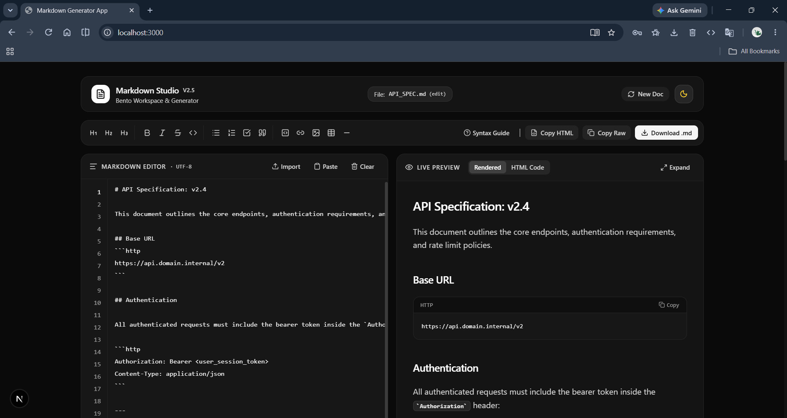
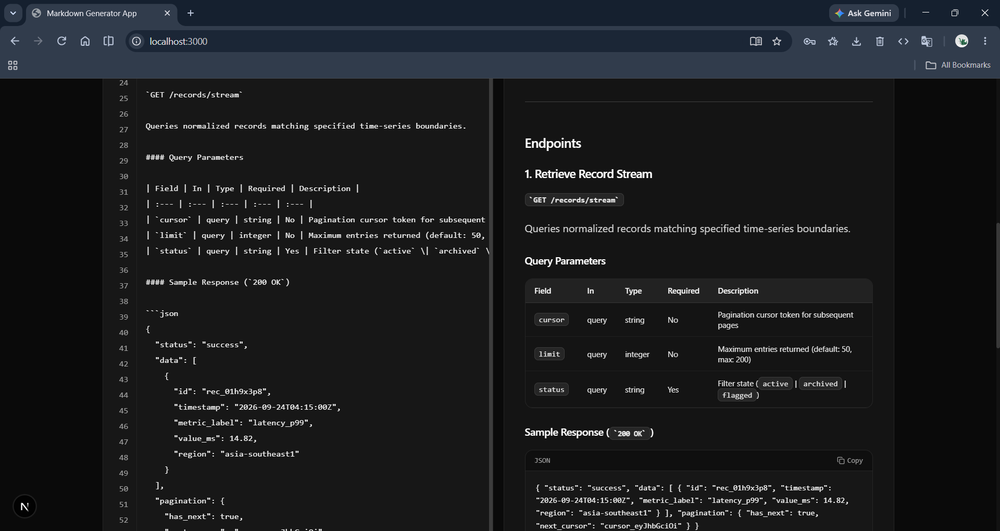
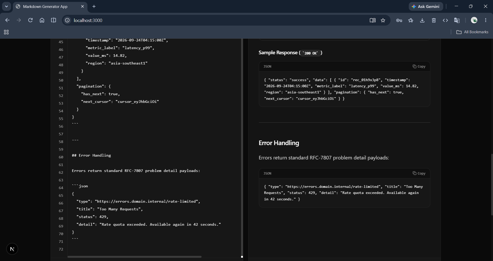
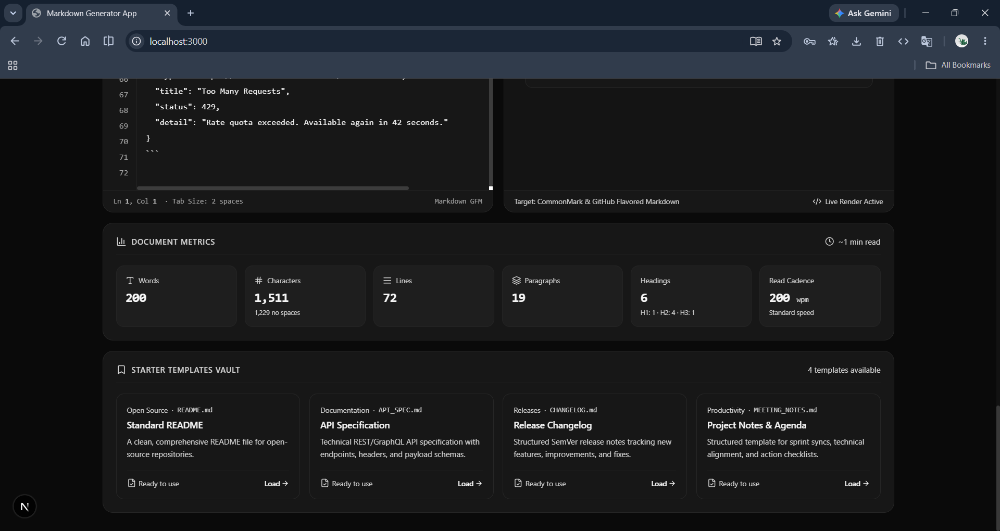

# Markdown Generator

A focused Markdown writing workspace built with Next.js. Compose Markdown in a fast editor, see the rendered result beside it, and export polished documents without leaving the browser.
## Preview





## Demo
[!Demo](assets/md-gen.mp4)

## Features

- Live Markdown preview with GitHub Flavored Markdown support
- Formatting toolbar for headings, emphasis, links, code, lists, quotes, and tables
- Starter templates for READMEs, API specifications, changelogs, and meeting notes
- Import local `.md` files and create new documents from scratch
- Download documents as `.md` files
- Copy raw Markdown or a standalone HTML representation to the clipboard
- Light and dark themes
- Live document statistics, including words, characters, lines, paragraphs, reading time, and headings
- Built-in Markdown cheat sheet

## Tech Stack

- Next.js 15 with the App Router
- React 19 and TypeScript
- Tailwind CSS 4
- `react-markdown` with `remark-gfm`
- Lucide React icons
- Motion for interface transitions

## Getting Started

### Prerequisites

- Node.js 20 or newer
- npm, pnpm, or Bun

### Installation

```bash
npm install
```

### Run the development server

```bash
npm run dev
```

Open [http://localhost:3000](http://localhost:3000) in your browser.

### Production build

```bash
npm run build
npm start
```

## Environment Variables

Copy `.env.example` to `.env.local` when deploying through Google AI Studio or when configuring the optional Gemini integration:

```bash
copy .env.example .env.local
```

`GEMINI_API_KEY` is reserved for Gemini API calls. The current editor workflow does not require an API key. `APP_URL` is used by hosted AI Studio deployments.

Never commit `.env.local` or expose a Gemini API key in client-side code.

## Available Scripts

| Command | Description |
| --- | --- |
| `npm run dev` | Start the development server |
| `npm run build` | Create a production build |
| `npm start` | Serve the production build |
| `npm run lint` | Run ESLint |
| `npm run clean` | Remove the Next.js build output |

## Project Structure

```text
app/                Next.js routes, layout, and global styles
components/         Editor, preview, toolbar, template, and stats UI
hooks/              Theme and responsive behavior hooks
lib/                Markdown templates and editor utility functions
```

## Usage

1. Start with the default README or choose a template from the template vault.
2. Write Markdown in the editor or upload an existing `.md` file.
3. Use the toolbar or cheat sheet to insert Markdown syntax.
4. Review the rendered document in the live preview.
5. Download the Markdown file or copy its raw source or HTML output.

## License

This project does not currently include a license file. Add a license before distributing it publicly.
